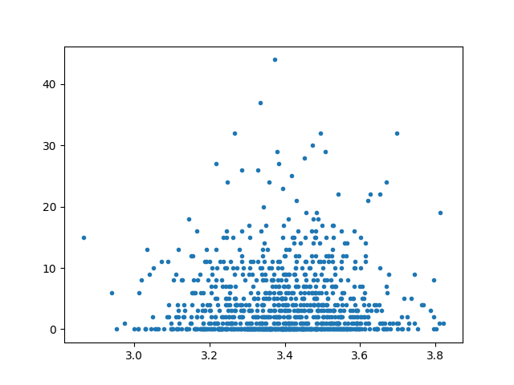

# shiny-robot
### Analyzing how the spatial distribution of given number in a sudoku influences the difficulty for a SAT solver. 

The goal of this project was to examine whether the spatial distribution of given number has an influence onto the 
difficulty of a sudoku for a satisfiability solver.

Therefore, different metrics were developed and tested, mainly the average distance between all given numbers in the 
sudoku grid, the average distance of all given numbers to their common centroid and the sudokus shannon entropy.

In the end, no correlation between the number of conflicts during the solving process and the measure dispersion metrics
was found.

## Content

* `data`: Data sets used in this project (10k sudokus with 25 given number and 49k with 17)
* `img`: Pictures and plots produced during this project.
* `results`: Text output of experiments.
* `experiments`:
    * `distances.py`: Implementing different metrics to measure dispersion.
    * `entropy.py`: Implementing Shannon entropy for sudokus to measure dispersion.
    * `evaluation.py`: Evaluate the final hypothesis.
    * `extremes.py`: Try to generate sudokus with extremely low / high dispersion.
    * `metrics.py`: See if dispersion metrics are correlated.
* `general.py`: Implement classes and function used in many parts of the project (sudoku and sudoku collection class etc.)
* `sudoku_solver.py`: SAT solver to solve sudokus with efficient encoding.
* `terminal_py_solve.py`: Helper script for SAT solver.

## Usage

This projec thas been written in `Python 3`. To use the project, install the requirements using the following command:

    pip3 install -r requirements.txt
    
For annoying reason, you also have to install the `Python 2` version of `numpy`:

    pip install numpy
    
Afterwards, you can execute all the experiments by just executing their respective module, e.g.:

    python3 experiments/evaluation.py
